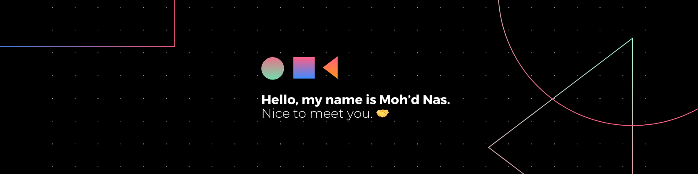

<<<<<<< HEAD
<!--Banner-->

<!--Night Owl image-->

  

<!--Header Name-->
#  ɪ'ᴍ ᴍᴏʜ'ᴅ ɴᴀs! 
*Digital Craftsman (Developer / Programmer)*
  

<!--Start Intro-->               

I am a Full Stack Developer with a focus on web development using Next.js, React, JavaScript, TypeScript, Tailwind CSS, and Material UI. I also have a background in Android development with Java and Kotlin.

- ✨ Student of life :)
- 🌱 I’m currently learning advanced web development techniques and collaboration.
- 💻 Working on multiple projects including **NSP (Nigerian Startup Portal)** and **Tech Atlas**.
- 🤝 Collaborating with other developers and contributing to open source.
- 💼 Managing projects, adapting to new languages, and maintaining high standards.
- ⏱️ Time management and prioritizing tasks effectively.
=======
# Welcome to My GitHub Profile 👋

## About Me

I have a background in **Computer Science** and started with Android development using Java and Kotlin. 
Now, I'm focusing on **web development** with the following technologies:

- **Next.js**
- **React**
- **JavaScript**
- **TypeScript**
- **Tailwind CSS**
- **Material UI**
>>>>>>> 4a366a657ab4d0eb736dd5deee0042e126b03cc1

### Current Projects

- **NSP (Nigerian Startup Portal)**: A platform supporting Nigerian startups.
- **Tech Atlas**: A tool for tech centers and resources.

<<<<<<< HEAD
### Connect With Me

- 📫 You can reach me at [mohdnas0001@gmail.com](mailto:mohdnas0001@gmail.com)
- 🌐 Connect with me on [LinkedIn](https://linkedin.com) or follow me on [Twitter](https://twitter.com)
=======
### What I’m Currently Doing

- 🔭 **Working on**: NSP and Tech Atlas
- 🌱 **Learning**: Advanced web development techniques and collaboration
- 💼 **Managing Projects**: Overseeing project timelines, coordinating tasks, and ensuring milestones are met efficiently.
- 🌐 **Adapting to New Languages**: Quickly learning and integrating new programming languages and frameworks to enhance project capabilities.
- 🤝 **Collaborating with Team Members**: Working closely with developers, designers, and stakeholders to achieve project goals and deliver high-quality results.
- ⏱️ **Time Management**: Prioritizing tasks effectively to meet deadlines and optimize productivity.
- 🏆 **Maintaining High Standards**: Committing to high-quality work by adhering to best practices and continuously improving skills.

### Connect With Me

- 📫 You can reach me at [mohdnas0001@gmail.com](mailto:mohdnas0001@gmail.com)
- 🌐 Connect with me on [LinkedIn](#) or follow me on [Twitter](#)
>>>>>>> 4a366a657ab4d0eb736dd5deee0042e126b03cc1

### Fun Fact

- 🤔 I’m fluent in three languages.
<<<<<<< HEAD

<!--Profile Count Badge-->

  

---

<!--Languages and Tools Section-->       
<h2 align="center">Tᴇᴄʜ Sᴛᴀᴄᴋ & Lᴀᴛᴇsᴛ Bʟᴏɢs</h2> 
<picture>
  <source media="(prefers-color-scheme: dark)" srcset="./Skills_Animation_Dark.gif">
  <source media="(prefers-color-scheme: light)" srcset="./Skills_Animation_White.gif">
  
</picture>
 

<h3 align="left">Current Learning</h3>
<ul align="left">
  <li>Deepening my knowledge in web development and front-end frameworks.</li>
  <li>Exploring advanced React.js patterns and state management techniques.</li>
  <li>Improving my skills in TypeScript and Tailwind CSS.</li>
</ul>
  
<h3 align="left">Latest Blog Posts</h3>
<ul align="left">
  <li><a href="#">Your First Blog Post</a></li>
  <li><a href="#">Understanding TypeScript</a></li>
  <li><a href="#">Mastering Tailwind CSS</a></li>
</ul>
 
 
 
 

---

<!--Dynamic Quote card updates everyday at 12 PM--> 
<h2 align="center">🌟 Tʜᴏᴜɢʜᴛ ᴏғ ᴛʜᴇ Dᴀʏ 🌟</h2>

<!--STARTS_HERE_QUOTE_CARD-->

    

<!--ENDS_HERE_QUOTE_CARD-->

---

<!--Contact Section--> 

<h2 align="center">🤝 Cᴏɴɴᴇᴄᴛ Wɪᴛʜ Mᴇ 🤝 </h2>

  

 

<!--Buy me a coffee-->

<!--Footer--> 

  

=======
>>>>>>> 4a366a657ab4d0eb736dd5deee0042e126b03cc1

