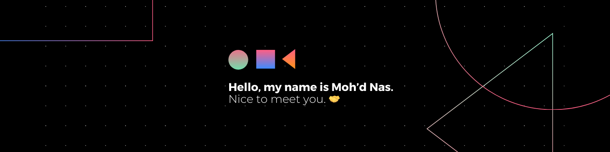

<picture>
  <source media="(prefers-color-scheme: dark)" srcset="./banner.png">
  <source media="(prefers-color-scheme: light)" srcset="./2.png">
  
</picture>

<h1 align="center">Nasir Mohammed</h1>

<b>Full‑Stack Developer</b> • Next.js • React • TypeScript

  <a href="mailto:mohdnas0001@gmail.com">Email</a> ·
  <a href="https://www.linkedin.com/in/nasir-mohammed-747762318">LinkedIn</a> ·
  <a href="https://x.com/northnas0?s=21">X</a> ·
  <a href="https://github.com/mohdnas0001?tab=repositories">Repos</a>

---

### About
I build fast, responsive web apps with **Next.js, React, TypeScript**, and modern UI tools (**Tailwind, Material UI**).  
Background in **Android (Java/Kotlin)**.

### Featured work
- **CAC Portal** — Portal system for streamlined processes and records.
- **Sule Lamido University — Journal System** — Journal publishing/management system.

### Tech
**Web:** Next.js, React, TypeScript, JavaScript  
**UI:** Tailwind CSS, Material UI  
**Mobile:** Android (Java, Kotlin)  
**Tools:** Git, GitHub
